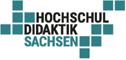
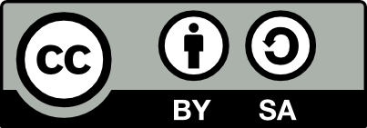
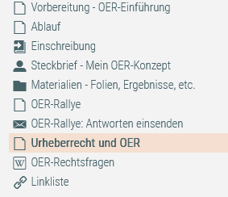

<!--
language: de
edit:     true
-->

# Didaktische Handreichung: Bildung für alle!

Open Educational Resources für die eigene Lehre finden, bearbeiten und teilen
=============================================================================


Empfehlungen zur Durchführung eines Digital Workspaces
------------------------------------------------------

<div style="display: flex; flex-wrap: wrap; align-items: center; gap: 20px;">

<!--style="height: 60px; background-color: white; margin: 10px"-->

<!--style="height: 60px; background-color: white; margin: 10px"-->

<!--style="max-width: 400px"-->
<!--style="height: 60px; background-color: white; margin: 10px"-->
Diese Maßnahme wird mitfinanziert durch Steuermittel auf der Grundlage des von den Abgeordneten des Sächsischen Landtags beschlossenen Haushalts.

</div>


## Digitalisierung der Hochschulbildung in Sachsen (DHS)


Stand: 05. 12.

[Digitalisierung der Hochschulbildung in Sachsen (DHS)](https://www.hd-sachsen.de/projekte/dhs)

Projektzeitraum: 2019 – 2024

**Konzeptionelle Arbeit/Redaktion**

Dominic Dives, Universität Leipzig\
Jana Riedel, Arbeitskreis E-Learning der Landesrektorenkonferenz Sachsen

**Kontakt**

Hochschuldidaktik Sachsen (HDS)\
Geschäftsstelle\
c/o Universität Leipzig\
Marschnerstraße 31\
04109 Leipzig

0341/97- 30080\
[programm@hd-sachsen.de](mailto:programm@hd-sachsen.de)

Titelgrafik von [Projekt Weiterbildung selbstorganisiert](https://selbstgesteuertes-lernen.de).
Lizenziert unter einer
[Creative Commons Namensnennung – Weitergabe unter gleichen Bedingungen 4.0 International Lizenz](https://creativecommons.org/licenses/by-sa/4.0/).
Anpassung: Farbfilter.

<!-- style="margin-top: 30px; height: 60px" -->

Diese „Didaktische Handreichung: Bildung für alle! Open Educational Resources für die eigene Lehre finden,
bearbeiten und teilen“ steht unter einer CC BY SA 4.0-Lizenz. Der Urheber soll wie folgt genannt werden:
Dives, Dominic & Riedel, Jana für Digitalisierung der Hochschulbildung in Sachsen | Hochschuldidaktik Sach-
sen (HDS) (2023)


## Steckbrief

_Alle im Steckbrief enthaltenen Informationen sind sowohl für Teilnehmende als auch für Trainer:innen relevant. Kurzbeschreibung und Lernziele sind deshalb für die direkte Teilnehmendenansprache formuliert, sodass sie für die Bewerbung des Digital Workspace unverändert übernommen werden können._

### Kurzbeschreibung

Open Educational Resources -- Offene Bildungsressourcen -- sind frei zugängliche Materialien, die bearbeitet, wiederverwendet und geteilt werden dürfen. Damit sollen Bildungsmaterialien besser zugänglich gemacht und ein Austausch unter Lehrenden ermöglicht werden. Verbunden mit dem Wunsch nach Zeitersparnis und einfacher Materialverwaltung suchen Lehrende nach geeigneten Materialien für ihre Veranstaltungen. Aber wo findet man diese und was muss dabei beachtet werden? Darüber hinaus können Lehrende auch selbst OER-Materialien erstellen und veröffentlichen, weil sie damit einen freien Zugang für viele Personen ermöglichen und zu einer Verbesserung der Chancengleichheit im Bildungsbereich beitragen. Welche Tools können sie zur Bearbeitung von OER-Materialien verwenden und was muss bei der Veröffentlichung eigener OER-Materialien beachtet werden? Der Digital Workspace widmet sich an zwei Tagen diesen beiden Perspektiven und begleitet die Teilnehmenden, bei der Entwicklung eigener Recherche- und Veröffentlichung von OER.

### Lernziele

Nach Abschluss des Workshops können die Teilnehmer*innen ...

- urheberrechtliche Herausforderungen in der (digitalen) Lehre erklären
- begründen, welchen Nutzen OER haben
- CC-Lizenzen erklären und deuten
- für sich relevante OER auf einschlägigen Portalen finden
- fremde OER mit verschiedenen Tools verändern/remixen
- (neu) erstellte OER unter der passenden Lizenz zur Verfügung stellen

### Zuordnung zu Handlungsfeldern [^1]

Die Veranstaltung wurde durch die Geschäftsstelle der Hochschuldidaktik Sachsen (HDS) den Handlungsfeldern Methoden, Medien & Digitales (7AE) und Lehr-/Lernplanung & Curriculumsentwicklung (3AE) zugeordnet.


[^1]: Die Einordnung orientiert sich an der in der Zertifikatsordnung der Hochschuldidaktik Sachsen (HDS) vorgegebenen Handlungsfelder. Weitere Informationen finden Sie [hier](https://www.hd-sachsen.de/angebote/zertifikate).

### Zielgruppe

Statusgruppen
-------------

Der Digital Workspace eignet sich für alle Hochschullehrenden (ohne weitere Einschränkungen).

Fächergruppen
-------------

Es handelt sich um ein fächerübergreifendes Angebot.

Level und notwendiges Vorwissen der Teilnehmenden
-------------------------------------------------

Der Digital Workspace eignet sich primär für Anfänger:innen. Die Teilnehmenden benötigen keine besonderen Vorkenntnisse.

Empfohlene Teilnehmendenzahl
----------------------------

Der Digital Workspace eignet sich für eine Gruppengröße von 5 bis zu 20 Teilnehmenden.

Format
------

Der Digital Workspace wurde als Online-Veranstaltung konzeptioniert.

Umfang und Ablauf des Workspace (AE)
------------------------------------

Der zweitägige Digital Workspace hat einen Gesamtumfang von 10 AE[^2], die vollständig synchron konzipiert sind.

Tag 1 (5 AE):

- Vorwissensanalyse / Austausch über Vorwissen
- Recherchestrategien für OER
- Suchen (und Speichern) von OER auf verschiedenen Plattformen für eigene Projekte
- Individuelle Beratung

Tag 2 (5 AE):

- urheberrechtliche Herausforderungen in der (digitalen) Lehre: Creative Commons
- Bearbeitung gefundener OER-Materialien mittels frei zugänglicher Werkzeuge
- Erstellung, Lizensierung und Teilen eigener OER-Materialien
- Kultur des Teilens: Bedeutung von OER

Barrierefreiheit
----------------

Keine Einschränkungen bezüglich des Themas

Methodischer Schwerpunkt: Ausprobieren, Erfahrungsaustausch

Verwendete technische Infrastruktur: Internet über Endgerät (empfohlen: Computer)

- Lernmanagementsystem: OPAL (Steckbrief, Wiki)
- Videokonferenzsystem: BigBlueButton (Break-Out-Sessions, geteilte Notizen, Whiteboard)

Weitere Informationen zur Barrierefreiheit befinden sich ausführlich im [Access Statement](#7.-Access-Statement).

[^2]: Arbeitseinheiten (1 AE = 45 min).


## Begleitmaterialien

- [Allgemeine Checkliste zur Durchführung des Digital Workspace](https://www.twillo.de/edu-sharing/components/render/3cfbf8ec-0aec-4de9-91b3-a285d2df6589)

- PowerPoint-Präsentationen

  - [Rahmenpräsentation Tag 1](https://www.twillo.de/edu-sharing/components/render/4d2dc34f-2f95-435f-b033-064045296d7b)
  - [Rahmenpräsentation Tag 2](https://www.twillo.de/edu-sharing/components/render/df600e70-bc7f-4bf5-aadf-f8d7c0dfeba5)
  - [Web-Rallye](https://www.twillo.de/edu-sharing/components/render/0931befd-86bb-46d8-9c63-50898aaa22fd)
  - [Impuls "Urheberrecht und OER" von Prof. Dr. Anne Lauber-Rhönsberg](https://tu-dresden.de/gsw/phil/irget/jfbimd13/ressourcen/dateien/vortraege/2019/Workshop-Urheberrecht-ALR_TUD_12-06-2019.pdf?lang=de)
  - [Vorbereitungsvideo inkl. Folien: „OER – Was bringt mir das? Und muss ich da mitmachen?“ von Jana Riedel](https://bildungsportal.sachsen.de/opal/auth/RepositoryEntry/516358148/CourseNode/101894479479848?0)


## 1. Einleitung

Liebe Leserin, lieber Leser, liebe Kollegin, lieber Kollege,

wir freuen uns, dass Sie auf unsere Weiterbildungsmaterialien aufmerksam geworden sind und unser thematisches Interesse teilen. Die vorliegenden Materialien, sowie diese begleitende Handreichung können Ihnen Hilfestellungen und Anstöße bei der Ausgestaltung Ihrer hochschuldidaktischen Qualifizierungsangebote sein. Alle Konzepte wurden im Rahmen des
[Verbundprojekts „Digitalisierung der Hochschulbildung in Sachsen“ (DHS)](https://www.hd-sachsen.de/projekte/dhs)
erstellt.

Das DHS-Verbundprojekt wurde durch eine Kooperation der Hochschuldidaktik Sachsen (HDS) und
des Arbeitskreises E-Learning der Landesrektorenkonferenz Sachsen (AKEL) initiiert. Die Förderung erfolgte durch das Sächsische Staatsministerium für Wissenschaft, Kultur und Tourismus (SMWK). Das Projekt wurde unter der Leitung der HDS und des AKEL gemeinsam mit den staatlichen sächsischen Universitäten und Hochschulen für Angewandte Wissenschaften durchgeführt.

Im Zeitraum von 2019 bis 2024 wurde in der Programmlinie „Digital Workspaces“ eine Vielzahl von digitalen Weiterbildungsangeboten im Werkstattformat organisiert und durchgeführt. Die Digital Workspaces boten Lehrenden der sächsischen Hochschullandschaft die Möglichkeit, thematisch fokussiert an individuellen digital gestützten Lehr-Lernprojekten zu arbeiten, sich didaktisch beraten zu lassen und Erfahrungen aus der eigenen Lehrpraxis auszutauschen. Zentrales Anliegen der Verbundpartner:innen war es, Formate zu schaffen, die neben kurzen Wissensinputs, Lehrpersonen vor allem Raum für die praktische Arbeit an eigenen Konzepten und maximale zeitliche sowie inhaltliche Flexibilität boten. Somit oblag es den Teilnehmenden, welche inhaltlichen Schwerpunkte sie wählten und in welchem Umfang sie sich an Workspaces beteiligten. Dementsprechend war je nach Teilnahmezeit sowohl eine teilweise als auch eine vollständige Anrechnung auf das sächsische Hochschuldidaktik-Zertifikat möglich.

Mit der Veröffentlichung unserer Digital-Workspace-Konzepte möchten wir einen Teil unserer Arbeitsergebnisse auch über das Projektende hinaus nutzbar machen, andere Hochschuldidaktiker:innen und Interessierte teilhaben lassen, unsere Projektergebnisse nachhaltig sichern und damit auch einen Beitrag zu einer offenen Bildungswelt leisten.

[Alle veröffentlichten Konzepte](https://www.twillo.de/edu-sharing/components/profiles/dhs%40hd-sachsen.de)
stehen unter einer CC BY-SA 4.0 Lizenz. Sie können daher alle Materialien weiterverwenden, teilen und bearbeiten, sofern eine Veröffentlichung unter derselben Lizenz erfolgt. Sie entscheiden, ob Sie das Konzept in seiner Gesamtheit oder nur Ausschnitte (z. B. Folien, Handreichungen, ...) daraus übernehmen möchten. Alternativ können Sie sich von unseren Materialien auch nur für Ihre eigene Arbeit inspirieren lassen. Ein [Steckbrief](#steckbrief) zum Digital Workspace enthält Eckdaten zur Veranstaltung, die sich an Teilnehmende und Trainer:innen richten. Anschließend finden Sie [organisatorische Hinweise](#2.-organisatorische-hinweise) gefolgt von [vertiefenden inhaltlichen Informationen](#3.-Überblick-über-den-Digital-Workspace), die sich nur an die Trainer:innen richten. Ausgehend von einer Übersicht in Form einer [ZIM-Tabelle](#3.2-Detaillierter-Ablaufplan-ZIM) gelangen Sie über Links zu Detailinformationen der einzelnen Lernphasen.

Wir wünschen Ihnen viel Erfolg und Freude bei der Verwirklichung Ihrer Weiterbildungsvorhaben.

_Dominic Dives und Jana Riedel für die Mitarbeiterinnen und Mitarbeiter des Projekts „Digitalisierung der Hochschulbildung in Sachsen“_


## 2. Organisatorische Hinweise

_Alle folgenden Informationen dienen der ausführlichen Erläuterung von Ablauf, Inhalt und Methoden des Digital Workspace. Sie richten sich deshalb ausschließlich an die Trainer:innen und sind nicht zur Weitergabe an Teilnehmende gedacht._

### 2.1 Benötigte Materialien & Tools

Folgende Materialien werden für die Durchführung benötigt:

- Referent:in für einen Impulsvortrag zum Thema „Urheberrecht und OER“
- Videokonferenzsystem mit BreakOut-Räumen
- Kurs in einem Lernmanagementsystem (LMS) mit folgenden Funktionen:

  - Wiki (für das Sammeln und Beantworten von Rechtsfragen)
  - Steckbriefe (für die persönliche Vorstellung und Bezugnahme zum Thema OER, ggf. auch als Forum)
  - Kontakt-Möglichkeit für das Einsenden der Lösungen aus der Web-Rallye (z.B. E-
    Mail, Chat, Forum, ...)
  - [Linkliste](#Anhang-6:-Linkliste-OER-Tools) (zur Verlinkung von nützlichen Tools zur Medienerstellung)

- [PowerPoint-Präsentation](https://www.twillo.de/edu-sharing/components/collections?id=6c0c3dec-2fa8-4511-8fb8-25deefd226bc)
- Einführungsvideo „OER kompakt“

  !?[Was sind Open Educational Resources?](https://www.youtube.com/watch?v=1WnZD7E8FKY)

- Ggf. Vertiefungsvideo „Digitale Lehre und Urheberrecht: §60a UrhG, Zitate, OER & Co.

  !?[YouTube](https://www.youtube.com/watch?v=Ckh5LV4RYMg "Was darf ich im Rahmen meiner Lehre nutzen? / [Quelle](https://open-educational-resources.de/was-ist-oer-3-2/)")


#### 2.1.1 LMS-Kurs

Der Kurs dient der Einschreibung der Teilnehmenden und der Bereitstellung der im Digital Workspace verwendeten Materialien und erarbeiteten Ergebnisse. Zusätzlich können Vorbereitungs- und Übungsaufgaben bereitgestellt werden. Hierzu zählen ein Vorbereitungsvideo, eine Aufgabe zur Vorstellung der eigenen OER-Vorhaben, eine OER-Rallye, eine Linkliste mit Tools zum Ausprobieren sowie ein Wiki, in dem Fragen und Antworten an eine:n Rechtsexpert:in gesammelt und dokumentiert werden.

Die Angebote wurden wie folgt strukturiert:




#### 2.1.2 Meetingraum Videokonferenztool einrichten

Das Videokonferenzsystem sollte über folgende Funktionen verfügen:

- Möglichkeit zum Zeichnen/Schreiben der Teilnehmenden auf vorbereiteten Folien (Mehrbenutzermodus) oder einem Whiteboard
- Geteilte Notizen (oder anderes kollaboratives Textwerkzeug) zum Sammeln von Fragen
- Teilnehmende sollen selbst erstelle Produkte vorstellen können: hierfür müssen Präsentationsrechte an Teilnehmende vergeben werden können, diese sollen den Bildschirm inkl. Ton teilen können (zum Beispiel zur Präsentation eines selbst erstellten Videos)

### 2.2 Ergänzende Empfehlungen für Trainer:innen

#### 2.2.1 Anzahl der Trainer:innen

Empfohlen wird eine Durchführung des Digital Workspace durch 1 - 2 Personen.

Neben einer Hauptmoderation ist die Übernahme folgender Aufgaben durch eine Co-Moderation ratsam:

- Fragen/Probleme im Chat beobachten und ggf. klären
- Rücklauf zur OER-Rallye empfangen und registrieren
- Antworten der Rechtsexpertin zu Fragen im Wiki protokollieren
- Individuelle Beratung in Phase der Produkterstellung anbieten


#### 2.2.2 Notwendiges Vorwissen und Kenntnisse der Trainer:innen

Allgemeine Kenntnisse und Kompetenzen

- souveräner Umgang mit dem gewählten Videokonferenzsystem
- Moderation von (Online-)Veranstaltungen
- Beratungskompetenz
- Mediendidaktik

Themenspezifische Kenntnisse und Kompetenzen

- Kenntnis von OER-Repositorien
- Kenntnis der empfohlenen Tools zur Erstellung eigener OER-Materialien
- Ggf. Erfahrung mit eigenen als OER veröffentlichten Materialien


## 3. Überblick über den Digital Workspace

### 3.1 Generelle Relevanz des Themas

Die Nutzung von Open Educational Resources (OER) für die Hochschullehre wird im Zusammenhang
mit der digital gestützten Lehre als Chance angesehen. Einerseits bieten OER die öglichkeit, Materialien anderer Autor:innen ohne zusätzliche Genehmigung und Nutzungserlaubnis in der eigenen Lehre einzusetzen. Lehrende müssen so nicht alle Materialien aufwendig selbst erstellen, sondern können auf bereits vorhandene Ressourcen zurückgreifen, ohne dabei das Urheberrecht zu verletzen. Hochschullehrende sollten daher Strategien kennen, wo und wie sie nach OER-Materialien suchen können und unter welchen (einfachen) Bedingungen sie diese nutzen dürfen.

Andererseits bietet die Veröffentlichung eigener Materialien als OER vielfältige Möglichkeiten für Hochschullehrende. Zusätzlich zur eigenen Sichtbarkeit und Reputation können sie wertvolles Feedback aus der Community erhalten, aus dem ggf. auch Lehrkooperationen und langfristiger Austausch nach dem Prinzip des Gebens und Nehmens entstehen kann.

Auch für die Betreuung von Projekten und Aufgaben, bei denen Studierende selbst (Lern-)Materialien erstellen sollen, ist die Verwendung von OER hilfreich. Einerseits können Studierende das Material nutzen und erweitert oder optimieren. Andererseits können die studentischen Produkte selbst als OER lizenziert werden, damit sie in folgenden Lehrveranstaltungen weiter genutzt und eingebunden werden können.

Um die Chancen, der Nutzung und Bereitstellung von OER kennenzulernen, müssen Hochschulleh-
rende für das Thema sensibilisiert werden und die Gelegenheit erhalten, erste eigene Erfahrungen zu machen. Insbesondere (urheber-)rechtliche Unsicherheiten sollten abgebaut werden, damit die Hochschullehrenden freier und offener bei der Verwendung und Erstellung von Lernmaterialien sind. Insofern ist OER nicht nur als Mittel zur Nutzung und Erstellung von ansprechenden Lernmaterialien zu verstehen, sondern auch als Haltung für ein Miteinander in der Lehre.


### 3.2 Detaillierter Ablaufplan - ZIM

#### 3.2.1 Vorbereitung des Digital Workspace

Ablaufplan zur Vorbereitung des Digital Workspace
-------------------------------------------------

1. __Zeitpunkt: Ca. 1 Woche vor Veranstaltung__

   __Aufgabe:__ Versand vorbereitender Informationen, inkl. Vorbereitungsaufgabe

   __Materialien:__

   - [Aufgabenstellung](#Willkommens-E-Mail-mit-Vorbereitungsaufgabe)
   - Video im LMS

   <!-- style="height: 2px; background-color: black" -->
   ----------------------

2. __Zeitpunkt: 30 min vor Beginn__

   __Aufgabe:__

    - Konferenzraum öffnen
    - Agenda in geteilte Notizen/Chat schreiben
    - Technik-Check


#### 3.2.2 Durchführung des Digital Workspace


##### Termin 1

1. **Dauer:** 30 min

   **Ziel & Zweck:** Einstieg & Ankommen

   **Inhalt:**

   - Vorstellung der Lernziele und des Tagesablaufs
   - Begriffsverständnis OER
   - Vorerfahrungen der Teilnehmenden

   **Methoden:**

   - Vortrag (mit Video)
   - [Definitionssammlung](#5.1.1-definitionssammlung)
   - [Standogramm](#5.1.2-standogramm)

   **Material & Tools:**

   - Präsentationsfolien 1- 9
   - Mehrbenutzermodus/ Whiteboard
   - !?[Video OER Kompakt (YouTube)](https://www.youtube.com/watch?v=1WnZD7E8FKY)

   **Ergänzende Hinweise:** Die Lösungen zu den Quizfragen befinden sich im Anhang.

-------------------------------------------------

1. **Dauer:** 30 min

   **Ziel & Zweck:** Aktivierung OER-Vorwissen

   **Inhalt:** Beantwortung vorbereiteter Wissensfragen zu:

   - OER-Recherche
   - CC-Lizensierung: Verwendung Materialien
   - CC-Lizensierung: Verwendung Bilder

   **Methoden:** Multiple-Choice-Quiz

   **Material & Tools:** Präsentationsfolien 11 - 15

   **Ergänzende Hinweise:** Die Lösungen zu den Quizfragen befinden sich im Anhang.

------------------------------------------------

3. **Dauer:** 60 min

   **Ziel & Zweck:** Recherchestrategien für OER erleben

   **Inhalt:** Die Teilnehmenden erhalten Suchaufträge, um auf verschiedenen Plattformen Angaben zu Urheber:innen und Nutzungsrechten zu finden. Die Beantwortung der Fragen ist als Wettbewerb gestaltet. Es gewinnt, wer zuerst alle Antworten korrekt eingesendet hat.

   **Methoden:** [Web-Rallye](#5.2.1-web-rallye)

   **Material & Tools:**

   - Präsentationsfolie 17
   - [Präsentation „OER-Webrallye“](https://www.twillo.de/edu-sharing/components/render/0931befd-86bb-46d8-9c63-50898aaa22fd) im LMS-Kurs
   - [Vorgabe, wohin die Antworten auf die Rechercheaufträge gesendet werden sollen](#Vorlage-zur-Beantwortung-der-Arbeitsauftrage-in-der-Web-Rallye)

   **Ergänzende Hinweise:** Die Rechercheaufträge waren als Präsentation auch noch einmal im LMS-Kurs eingebunden, damit ein individueller Bearbeitungsfortschritt möglich war. Die Lösungen zu den Aufgaben finden sich im Anhang.

---------------------------------------------

4. **Dauer:** 60 min

   **Ziel & Zweck:** PAUSE

---------------------------------------------

5. **Dauer:** 45 min

   **Ziel & Zweck:** Fragen an das Thema OER sammeln

   **Inhalt:**

   - Sammlung und Beantwortung von Fragen der Teilnehmenden.
   - Fragen mit einem rechtlichen Hintergrund werden für den Gastvortrag an Tag 2 gebündelt und im Wiki dokumentiert.

   **Material & Tools:**

   - Präsentationsfolie 20
   - Geteilte Notizen zum Sammeln der Fragen

   **Ergänzende Hinweise:** Rechtliche Fragen im Wiki sammeln.

----------------------------------------------------

6. **Dauer:** 45 min

   **Ziel & Zweck:** Individuelle Recherche- und Beratungsmöglichkeiten

   **Inhalt:**

   - Hinweise zum Vorgehen bei der Recherche
   - Bearbeitung des Arbeitsauftrags: Finden Sie geeignete OER-Materialien für Ihre Lehrveranstaltung. Beantworten Sie hierfür die [Leitfragen](#5.3-Erstellung-eines-Praxiskonzepts-durch-die-Teilnehmenden) in Ihrem OPAL-Steckbrief.

   **Methoden:** [Steckbrief schreiben](#5.2.2-Steckbrief-schreiben)

   **Material & Tools:**

   - Präsentationsfolien 22- 26
   - Vorbereiteter Steckbrief mit Leitfragen

----------------------------------------------------------

7. **Dauer:** 30 min

   **Ziel & Zweck:** Abschluss und Ausblick auf Tag 2

   **Inhalt:**

   - Ablauf Tag 2
   - Feedback

   **Methoden:** [Zielscheibenfeedback](#5.4.1-zielscheibenfeedback)

   **Material & Tools:**

   - Präsentationsfolien 27 - 30


##### Termin 2

1. **Dauer:** 30 min

   **Ziel & Zweck:** Einstieg & Gruppenbildung

   **Inhalt:**

   - Vorstellung der Lernziele und des Tagesablaufs
   - Warm-Up

   **Methoden:**

   - Vortrag
   - [Emoji-Film-Quiz](#5.1.3-emoji-quiz)

   **Material & Tools:** Präsentationsfolien 2-9

   **Ergänzende Hinweise:**

   Gruppenbildung je nach Gesamtzahl der TN.

   Die Lösungen zum Emoji-Quiz finden sich im Anhang.

-------------------------------------------------

2. **Dauer:** 30 min

   **Ziel & Zweck:** Freie Tools zur Erstellung freier Bildungsressourcen kennenlernen

   **Inhalt:**

   - 5 Tipps zur Lizenzierung
   - Vorstellung von Tools zur Erstellung von Materialien
   - Nutzung von H5P (Einbindung und Erweiterung von OER-Materialien)

   **Methoden:** Vortrag

   **Material & Tools:**

   - Präsentationsfolien 11 - 18
   - [Linkliste mit Tools](#linkliste-oer-tools)

------------------------------------------------------

3. **Dauer:** 15 min

   **Ziel & Zweck:** PAUSE

------------------------------------------------------

4. **Dauer:** 15 min

   **Ziel & Zweck:** Individuelle Bearbeitungsmöglichkeit (inkl. (Mittags-)Pause mit individueller Zeiteinteilung)

   **Inhalt:**

   - Die Teilnehmenden suchen sich ein Tool aus der Linkliste aus, mit dem sie ein eigenes OER-Produkt erstellen möchten.
   - Es besteht die Möglichkeit zur individuellen Beratung.

   **Methoden:** Individuelle Bearbeitung des Arbeitsauftrags

------------------------------------------------------

5. **Dauer:** 60 min

   **Ziel & Zweck:** Rechtliche Rahmenbedingungen beim Einsatz von OER kennenlernen

   **Inhalt:**

   - Rechtsbegriffe: Werk, geistige Schöpfung, wissenschaftliche/künstlerische/organisatorische Leistungen
   - Gesetzlich erlaubte Nutzungen von Werken (insb. §60a Unterricht und Lehre, §51 Zitate)
   - Quellenangaben
   - Änderungsverbot
   - Lizenzmodelle: Creative Commons

   **Methoden:** (Gast-)Vortrag und Fragerunde

   **Material & Tools:** Präsentationsfolien „[Urheberrecht und OER](https://tu-dresden.de/gsw/phil/irget/jfbimd13/ressourcen/dateien/vortraege/2019/Workshop-Urheberrecht-ALR_TUD_12-06-2019.pdf?lang=de)“

   **Ergänzende Hinweise:** Fragen vom ersten Tag (siehe Wiki) aufgreifen.\
   Antworten auf Rechtsfragen im Wiki dokumentieren.

--------------------------------------------------

6. **Dauer:** 45 min

   **Ziel & Zweck:** Präsentation der selbst erstellten Materialien

   **Inhalt:** Die Teilnehmenden werden gebeten, ihre erstellten Materialien und ihre Erfahrungen mit den genutzten Tools zu präsentieren

--------------------------------------------------

7. **Dauer:** 15 min

   **Ziel & Zweck:** Abschluss

   **Inhalt:**

   - Feedback
   - Evaluationslink

   **Methoden:** [Blitzlicht](#5.4.2-Blitzlicht)

   **Material & Tools:** Präsentationsfolien 20-23


## 4. Thematische Schwerpunkte

___Begriffsverständnis OER & Quiz zum OER-Wissen___

Die Teilnehmenden sollen sich zur Vorbereitung ein Vortragsvideo mit den grundlegenden Aspekten zum Thema OER ansehen. Damit alle Teilnehmenden auf dem gleichen Stand sind, erfolgt zu Beginn der synchronen Veranstaltungen eine kurze Wiederholung in Form einer Definitionssammlung und einiger Quizfragen.

___Recherchestrategien für OER___

Die Teilnehmenden sollen selbst erfahren, wie sie auf unterschiedlichen Plattformen nach Materialien suchen können und wo sie dort Informationen zu Nutzungsrechten und Urheberangaben finden. Deswegen sollen sie selbst auf Informationsrecherche gehen und an Beispielen die relevanten Informationen zur Lizenzangaben finden.

___Fragen sammeln___

Das Thema OER ist häufig mit Unsicherheiten verbunden. Um diese aufzufangen sollte die Möglichkeit gegeben werden, individuelle Fragen zu bündeln und zu beantworten.

___Individuelle Recherche___

In einem Digital Workspace soll der unmittelbare Transfer auf die eigene Lehrveranstaltung ermöglicht werden. Deswegen erhalten die Teilnehmenden anhand von Links und Leitfragen die Möglichkeit, Materialien zur Nachnutzung zu entdecken und zu sammeln.

___Tipps & Tricks___

Für die ersten Schritte zur Erstellung eigener OER-Materialien sollen die Teilnehmenden nützliche Informationen zur Lizenzierung und für Tools, die sie nutzen und ausprobieren können, erhalten.

___Individuelle Erstellung von OER-Materialien___

Die Teilnehmenden sollen ein eigenes OER-Produkt erstellen. Die Selbsterfahrung im Erstellungsprozess ist eine wichtige Möglichkeit, um weitere Fragen aufzudecken und diese anschließend gemeinsam zu beantworten.

___Urheberrecht und OER___

Mit dem Thema OER sind unweigerlich rechtliche Fragen und Herausforderungen im Kontext des Urheberrechts verbunden. Deswegen sollten die wichtigsten Grundzüge des Urheberrechts in der Lehre dargelegt werden und für eine rechtskonforme Nutzung von Materialien sensibilisiert werden. Es muss darauf hingewiesen werden, dass es sich hierbei nicht um eine Rechtsberatung handelt, sondern um allgemeine Informationen und eine Einführung in das Rechtsgebiet. Es ist hilfreich, hierbei die Expertise einer/eines Jurist:in in Form eines Gastvortrags einzubeziehen.

## 5. Methoden & Aufgaben

### 5.1 Kennenlernen

#### 5.1.1 Definitionssammlung

Die Methode dient der Aktivierung des Vorwissens und dem Abgleich der Begriffsverständnisse in der Gruppe. Die Teilnehmenden schreiben eine kurze Definition zu einem vorgegebenen Begriff auf. Die Antworten werden auf einem Whiteboard für alle sichtbar gesammelt.

#### 5.1.2 Standogramm

Das Standogramm – in Präsenzformaten auch oft als Aufstellung bezeichnet – ist eine weit verbreitete Kennenlernmethode. In der Online-Variante geht es darum, sich mit einem kleinen Punkt oder Kreuz in einem Raster, einer Tabelle oder einer Karte zu positionieren. Die Beliebteste und sicher bekannteste Form des Standogramms ist die Landkarte, auf der sich Teilnehmende ihrem Hochschulstandort, ihrem Platz im Home-Office oder zum Beispiel auch ihrem nächsten Urlaubsort zuordnen können. Im vorliegenden Workspace verorten sich die Teilnehmenden in einem Koordinatensystem, in welchem sie ihre Vorerfahrungen (y-Achse) und ihren Interessensschwerpunkt nach „Suchen“ und „Erstellen“ (x-Achse) eintragen.

#### 5.1.3 Emoji-Quiz

Ob Filme, Sprichwörter oder Lieder - bekannte Titel werden durch Emoji-Symbole dargestellt. Die Teilnehmenden müssen diese entschlüsseln und den richtigen Begriff erraten. Wer am schnellsten antwortet, gewinnt.

### 5.2 Arbeitsphase

#### 5.2.1 Web-Rallye

Die Teilnehmenden sollen selbstständig im Internet nach Informationen suchen. Hierfür werden Suchaufträge und ggf. hilfreiche Links zur Verfügung gestellt. Zu jedem Suchauftrag sollte es eine möglichst einfache Lösung geben (z. B. ein Wort, ein Satz), mit der die Frage eindeutig (richtig/falsch) beantwortet werden kann. Die Web-Rallye wird als Wettbewerb durchgeführt, bei dem es darauf ankommt, am schnellsten alle richtigen Antworten zu finden und einzusenden. Die Teilnehmenden notieren alle Antworten und senden diese anschließend per E-Mail an die Trainer: innen (wichtig ist, dass die Antworten nicht für andere Teilnehmende einzusehen sind, der Zeitstempel der Abgabe und der Name der absendenden Person eindeutig ist).

#### 5.2.2 Steckbrief schreiben

Diese Methode ist eine Aktivität, bei der Teilnehmende kurze Profile oder Zusammenfassungen über sich selbst oder andere Personen erstellen. Diese Steckbriefe enthalten wichtige Informationen, Eigenschaften, Interessen oder berufliche Hintergründe. Sie dienen damit dazu, sich in Weiterbildungen oder Kleingruppen besser kennenzulernen. Folgende Kategorien/Fragen enthält der Steckbrief im vorliegenden Workspace:

- Wo ich lehre ... (Fachbereich)
- Wie ich lehre ... (Veranstaltungsform, besondere Lehrformate, Lehrmaterialien, ...)
- Mein Bezug zu OER ... (Vorerfahrungen, Erwartungen, bereits veröffentlichte Materialien, ...)
- Wonach ich suche ... (Welche OER möchten Sie nutzen: Art, Thema, Umfang)
- Was ich schon gefunden habe ...
- Was ich anpassen muss ...
- Was ich (mit meinen OER) vorhabe ...

### 5.3 Erstellung eines Praxiskonzepts durch die Teilnehmenden

Die Teilnehmenden erstellen kein typisches Lehrveranstaltungskonzept, sondern dokumentieren ihre Recherchestrategie und -ergebnisse in ihrem Steckbrief (siehe oben). Diese Dokumentation stellt gleichzeitig eine Verschriftlichung relevanter Entscheidungen für ein Konzept dar. Folgende Leitfragen stehen ihnen dabei zur Verfügung:

1. Für welchen Fachbereich suchen Sie Materialien?

2. Für welche Veranstaltungsform suchen Sie Materialien? Welche Art von Materialien suchen Sie?

   > __Hinweis:__
   > Je nach didaktischem Ziel Ihrer Veranstaltung können unterschiedliche Materialien zum Einsatz kommen. Zum Beispiel...

   - zur Wissenvermittlung --> Erklärvideos, eBooks, interaktive Lernmodule, ...
   - zur Übung --> Arbeitsblätter, Quizzes, ...
   - zur Weiterverarbeitung in studentischen Gruppenarbeiten --> Bilder, Texte, Karten, Audio-Dateien, ...

3. Wo haben Sie schon einmal nach OER gesucht? Welche Suchstrategien haben Sie verwendet?

4. Was haben Sie bereits gefunden? Inwiefern müssen Sie dieses Material bearbeiten? Wie betten Sie das Material in Ihre Lehrveranstaltung ein?

### 5.4 Evaluation & Feedback

#### 5.4.1 Zielscheibenfeedback

Die Trainer:innen zeigen eine Zielscheibe (bspw. in der PowerPoint-Präsentation), die aus mehreren Ringen besteht. Diese Ringe werden mit Querstrichen in Bereiche unterteilt. Jedem Bereich wird eine Feedback-Dimension zugeordnet. Diese können "Inhalt", "Struktur", "Methodik", "Transfer" oder ähnliches sein. Die Teilnehmenden sollen nun entsprechend ihres Eindrucks je ein Kreuz in die Zielscheibe setzen. Je weiter innen das Kreuz ist, desto besser ist die Bewertung des entsprechenden Feldes bzw. Schwerpunktes. Im vorliegenden Workspace wurden folgende Bereiche abgefragt: Begrifflichkeit OER, Methodik, Transfer.

#### 5.4.2 Blitzlicht

Die Blitzlicht-Methode ermöglicht es, in kurzer Form Feedback oder einen Kommentar zu einem Thema oder einer Fragestellung zu erhalten. Alle Teilnehmenden werden aufgefordert, ihr Statement in einem (kurzen) Satz zu formulieren. Die Methode verläuft sehr aktiv und ermöglicht es, unterschiedliche Perspektiven einzufangen und den Dialog anzuregen. Die Moderation sollte darauf achten, dass alle Teilnehmenden mit einer kurzen Aussage zu Wort kommen, aber (noch) keine Diskussion stattfindet. Folgende Frage zum Feedback wird gestellt: Was nehme ich aus dem Workspace mit?

## 6. Ideen für Optimierungs- und Erweiterungsmöglichkeiten

Die aktuelle Umsetzung bietet viel Raum für Selbsterfahrung der Teilnehmenden, die im Anschluss diskutiert und Unsicherheiten aufgefangen werden können. Davon können einige Teilnehmende überfordert werden, in diesen Fällen kann mehr Input und Anleitung von Vorteil sein. Da die meisten Fragen jedoch durch die Anwendung entstehen, sollen die Möglichkeiten zur Selbsterfahrung nicht zu kurz kommen.

Eine verbindliche und sichere Dokumentation der Antworten auf Rechtsfragen ist eine große Herausforderung. Alternativ zu einer Protokollierung von Antworten wäre die Bereitstellung von Links zu FAQs/Foren für Rechtsfragen denkbar (z. B. https://irights.info/, https://oer-faq.de/).

## 7. Access Statement

### 7.1 Erklärung zur Barrierefreiheit im Digital Workspace „Bildung für alle! Open Educational Resources für die eigene Lehre finden, bearbeiten und teilen“

Allen Teilnehmenden eine optimale Lernerfahrung in unseren Digital Workspaces zu ermöglichen, ist uns wichtig. Dies umfasst die lernendenorientierte didaktische Gestaltung ebenso wie die möglichst barrierefreie Bereitstellung des Angebotes. Bisher konnten wir im Rahmen unserer eigenen technischen und zeitlichen Ressourcen nicht alle Barrieren beseitigen. Mit den folgenden Angaben möchten wir unsere Maßnahmen zur Minderung von Barrieren sowie evtl. weiterhin bestehende Barrieren transparent darstellen. Dies soll Nutzenden unserer Materialien bei der Einschätzung helfen, ob ggf. eigene Maßnahmen ergriffen werden sollten, um das Angebot noch barrierearmer zu gestalten.

Barrieren können in der Durchführungsform, dem Thema des Workspace, den eingesetzten Methoden, der Aufbereitung der einzelnen Materialien oder der verwendeten technischen Infrastruktur begründet sein. Auf diese weisen wir im Folgenden separat hin.

Des Weiteren empfehlen wir, Teilnehmende dazu einzuladen, individuelle Bedarfe (z. B. aufgrund einer Beeinträchtigung, Care-Aufgaben) vorab mitzuteilen. Geben Sie hierfür eine geeignete Kontaktmöglichkeit an und weisen Sie drauf hin, dass die Informationen nicht gespeichert werden.

### 7.2 Hinweise zur Geschlechtersensibilität

In unserem Digital Workspace stand es allen Personen frei, mit einem selbst gewählten Namen und Pronomen teilzunehmen. Gegebenenfalls ist es aber nicht immer möglich, die systembedingten Voreinstellungen zu Name und Geschlecht anzupassen. Auch in diesem Fall konnten sich Teilnehmende vertrauensvoll an uns wenden.

### 7.3 Hinweise zur Durchführungsform

Der Workspace wurde als Online-Veranstaltung mit synchronen Terminen über BigBlueButton
durchgeführt. Zusätzlich standen Materialien und Kommunikationsmöglichkeiten für die asyn-
chrone Bearbeitung der Workspace-Inhalte über die Lernplattform OPAL zur Verfügung. Barrieren
ergeben sich daher vor allem in Bezug auf die genutzte technische Infrastruktur (siehe unten).

### 7.4 Hinweise zu möglichen Einschränkungen in der Teilnahme aufgrund des Themas[^3]

In diesem Workspace liegt der inhaltliche Fokus auf der Suche und dem Erstellen von Lernmaterialien mit OER-Lizenzangabe. Dieser Fokus ist per se nicht mit Barrieren verbunden.

[^3]: Es handelt sich lediglich um einen Hinweis auf potenzielle Einschränkungen.
      Damit sollen ausdrücklich keine Teilnahmevoraussetzungen statuiert werden.

### 7.5 Hinweise zum Methodeneinsatz

In unserem Digital Workspace stehen der Austausch und die Diskussion mit anderen Teilnehmenden sowie den Expert:innen im Mittelpunkt. Hierfür setzen wir verschiedene Methoden ein, für die die Nutzung von Audio, Video und Breakout-Räumen in BigBlueButton erforderlich ist. Darüber hinaus nutzen wir asynchrone, schriftliche Austauschformate bspw. über das Forum oder Wiki in unserem OPAL-Kurs. Hier ergeben sich Barrieren in Bezug auf die technische Infrastruktur (siehe unten).

### 7.6 Hinweise zur Aufbereitung der Materialien

Folgende Maßnahmen haben wir ergriffen, um mögliche Barrieren bei der Bereitstellung der Materialien zu reduzieren:


- Bereitstellung von Text- und Präsentations-Dateien

  - [X] Dateien werden als PDF und als bearbeitbares Dateiformat (i. d. R. Word oder PowerPoint[^4]) bereitgestellt.
  - [ ] Für PDFs wird der Standard PDF/UA berücksichtigt.
  - [X] Wir verwenden Formatvorlagen für Überschriften, Absätze, Listen.
  - [X] Wir kennzeichnen dekorative Elemente als solche.
  - [X] Wir achten auf ausreichend große Schriftgrößen und kontrastreiche Farben.
  - [X] Wir verwenden Alternativtexte für Bilder und Grafiken.
  - [ ] Alle Dokumente sind mit Metadaten versehen und die Dokumentsprache ist hinterlegt.

- Bereitstellung von Videos

  - [ ] Wir verwenden Videos mit Untertiteln.
  - [ ] Wir bieten für jedes Video einen Beschreibungstext an.
  - [ ] Wir vermeiden eine rein visuelle Informationsvermittlung, indem wir visuell vermittelte Informationen auch mündlich erklären.
  - [ ] Falls wir auf Videos verlinken, die die o. g. Maßnahmen nicht umsetzen, ist dies entsprechend vermerkt. Wo möglich stellen wir alternative Materialien zur Erarbeitung des Inhalts bereit.

- Bereitstellung von Audio-Dateien

  - [ ] Wir stellen Transkripte für verwendete Audio-Dateien zur Verfügung.
  - [ ] Falls wir auf Audio-Dateien verlinken, für die wir kein Transkript bereitstellen können, ist dies entsprechend vermerkt.

Unsere Angebote führen wir in der Regel in deutscher Sprache durch. Materialien werden in deutscher oder englischer Sprache bereitgestellt. Alle Materialien stellen wir vorab zur Verfügung, um eine Vorbereitung zu ermöglichen.

Alle Dokumente lassen sich auch mit nicht-proprietärer Software bearbeiten.


### 7.7 Hinweise zur genutzten Infrastruktur

Dieser Workspace fand ausschließlich online statt. Zur Nutzung des Kurses sind eine Internetanbindung und ein Computer notwendig. Für die Teilnahme an Online-Meetings ist eine stabile Internetverbindung erforderlich.[^5] Die Nutzung eines Headsets und einer Webcam wird empfohlen.

In diesem Digital Workspace haben wir folgende Web-Anwendungen genutzt. Diese Systeme wurden uns von Dienstleistungsunternehmen bereitgestellt und verfügen über eigene Barrierefreiheitserklärungen. Die wichtigsten Aspekte zur barrierearmen Nutzung der Systeme sind unter der Liste der verwendeten Web-Anwendung aufgelistet und wo möglich verweisen wir auf die Barrierefreiheitserklärungen der Anwendungen.

Liste der verwendete Web-Anwendungen:

- Lernmanagementsystem: [OPAL](https://bildungsportal.sachsen.de)
- Videoplattform:

  - [Videocampus Sachsen](https://videocampus.sachsen.de)
  - [YouTube](https://www.youtube.com)

- Videokonferenzsystem: [BigBlueButton](https://bigbluebutton.org)
- Plattformen für OER-Materialien:

  - [Flickr](https://www.flickr.com)
  - [WikimediaCommons](https://commons.wikimedia.org)
  - [memucho](https://memucho.com)
  - [soundcloud](https://soundcloud.com)
  - [oercommons](https://www.oercommons.org)

[^5]: Gegebenenfalls können Teilnehmende bei Bedarf den Datensparmodus im Videokonferenzsystem aktivieren, um die empfangene Datenrate zu reduzieren. Dies kann jedoch die Beteiligungsmöglichkeiten einschränken.

#### 7.7.1 Lernmanagementsystem OPAL

__(Stand: 07.11.2023)__

Standardelemente der Lernplattform wie Login, das Forum und Dokument-Download sind derzeit
barrierefrei bedienbar. Darüber hinaus ist OPAL aktuell noch nicht vollständig barrierefrei. Insbesondere für sehbeeinträchtigte Personen sind die Funktionen noch nicht nach aktuellen Standards der [BITV](https://www.gesetze-im-internet.de/bitv_2_0/BJNR184300011.html) nutzbar. Die Verantwortung für die in OPAL bereitgestellten Materialien (Dateien, Videos, o. ä.) inklusive deren barrierefreien Nutzungsmöglichkeiten tragen die Kursverantwortlichen.

[Zur Barrierefreiheitserklärung von OPAL](https://bildungsportal.sachsen.de/opal/accessibility?1)

#### 7.7.2 Videokonferenzsystem Big Blue Button

__(Stand: 07.11.2023)__

BigBlueButton ist nach dem [WCAG2.0-Standard](https://www.w3.org/TR/WCAG20/) als barrierefreie Anwendung zertifiziert und ermöglicht die barrierefreie Nutzung des Chats. Weitere in unserem Workspace genutzte Funktionen, wiedas interaktive Whiteboard, die geteilten Notizen und die Break-Out-Räume können nicht barrierefrei erreicht werden. Die Informationsübermittlung erfolgt hauptsächlich über den Audio-Kanal, eine Untertitelungsoption kann bei Bedarf angeboten werden (jedoch nicht für Breakout-Rooms). Verwendete Präsentationsfolien stellen wir vorab im zugehörigen OPAL-Kurs bzw. während des Online-Meetings in einer barrierefreien Version zur Verfügung.

[Zur Barrierefreiheitserklärung von Big Blue Button](https://bigbluebutton.org/accessibility/)

## Anhang

1. [Willkommens-E-Mail mit Vorbereitungsaufgabe](#Willkommens-E-Mail-mit-Vorbereitungsaufgabe)
2. [Lösungen zu Quizfragen](#Lösungen-zu-Quizfragen)
3. [Vorlage zur Beantwortung der Arbeitsauftrage in der Web-Rallye](#Vorlage-zur-Beantwortung-der-Arbeitsauftrage-in-der-Web-Rallye)
4. [Lösungen zur Web-Rallye](#Lösungen-zur-Web-Rallye)
5. [Lösungen zum Emoji-Quiz](#Lösungen-zum-Emoji-Quiz)
6. [Linkliste OER-Tools](#Linkliste-OER-Tools)

### Willkommens-E-Mail mit Vorbereitungsaufgabe

Folgende E-Mail wurde eine Woche vor dem ersten Workspace-Team versendet:

<section style="
  margin: 2rem auto;
  padding: 2.25rem 2rem;
  background:#fffdfa;
  color:#2b2b2b;
  border:1px solid #d8d2c4;
  border-radius:10px;
  box-shadow:
    0 0 0 8px #f7f5ee,
    0 10px 24px rgba(0,0,0,.08);
  font-family: Georgia,'Times New Roman',serif;
  line-height:1.65;
  letter-spacing:.01em;
">

_Liebe Teilnehmerinnen und Teilnehmer unseres Digital Workspaces zum Thema OER,_

_wir freuen uns, dass wir ab kommenden Dienstag mit Ihnen gemeinsam tiefer in das Thema der offenen Bildungsressourcen einsteigen werden._

_Bitte sehen Sie sich bis dahin das Video zur Vorbereitung im OPAL-Kurs an, damit alle Teilnehmenden über den gleichen Wissensstand verfügen und wir unmittelbar in die Arbeit zur Recherche Ihrer eigenen OER-Materialien einsteigen können._

_Am Dienstag, DATUM ab UHRZEIT Uhr starten wir dann gemeinsam in folgendem Raum von BigBlueButton: LINK ZUM ONLINE-RAUM._

_Bitte stellen Sie sicher, dass Sie ein Mikrofon und eine Webcam zur Verfügung haben, damit wir uns besser austauschen können. Wir werden ab UHRZEIT für einen Technik-Check im Raum zur Verfügung stehen. Sollten Sie technische Probleme haben, erreichen Sie uns per E-Mail._

_Bis dahin grüßen Sie herzlich Dominic Dives und Jana Riedel (Ihre Workspace-Leitung)_

</section>

### Lösungen zu Quizfragen

_Frage 1_

**Warum ist die Google-Suche oft nicht die erste Wahl, um OER zu recherchieren?**

- [[X]] Weil es oft gar keine Hinweise zur verwendeten Lizenz gibt.
- [[ ]] Google ist dafür bekannt nur Inhalte aufzulisten, die nicht unter freier Lizenz stehen.
- [[X]] Unter dem gewählten Suchbegriff gibt es manchmal keine frei lizenzierten Inhalte.
*********************

> Die Google-Suche ist oft nicht die beste Wahl, um OER (Open Educational Resources) zu recherchieren, weil:
>
> - Es gibt häufig keine klaren Hinweise auf die verwendete Lizenz, sodass man nicht sicher weiß, ob und wie man das Material weiterverwenden darf.
> - Unter dem gewählten Suchbegriff erscheinen oft keine frei lizenzierten Inhalte, sondern viele Ergebnisse ohne offene Lizenz.
>
> Deshalb ist es sinnvoll, gezielt OER-Plattformen oder spezialisierte Suchmaschinen für freie Bildungsmaterialien zu nutzen.

*********************

_Frage 2_

**Eines Ihrer gefundenen Videos steht unter einer der Lizenz CC BY-NC-ND. Welche der folgenden Aussagen trifft auf das Video zu?**


- [[ ]] Wenn ich nur einen Ausschnitt daraus benötige, darf ich es mit einem Schnittprogramm bearbeiten.
- [[ ]] Eine Hochschule darf das Video auf ihrer internen Plattform zur Verfügung stellen.
- [[ ]] Das Video darf heruntergeladen und gespeichert werden.
- [[ ]] Als freiberufliche:r Trainer:in darf ich das Video meinen Kunden bereitstellen, falls der Autor bzw. die Autor:in genannt wird.
*********************

> Die Lizenz CC BY-NC-ND bedeutet: Namensnennung (BY), keine kommerzielle Nutzung (NC) und keine Bearbeitung (ND). Das Video darf nur unverändert und nicht-kommerziell genutzt werden, immer mit Nennung des Urhebers. Es ist nicht erlaubt, das Video zu bearbeiten, weiterzugeben, öffentlich zugänglich zu machen oder für kommerzielle Zwecke zu nutzen. Keine der genannten Aussagen in der Frage trifft daher zu.

*********************


_Frage 3_

**Folgende Bilder wurden über die Google-Bildersuche gefunden. Dürfen Sie sie weiterverwenden und bearbeiten?**

 [CC BY 2.0](https://creativecommons.org/licenses/by/2.0)]")

- [(X)] Ja
- [( )] Nein
*******************************************

> __Was bedeutet CC BY 2.0?__
>
> - __BY (Attribution / Namensnennung):__
>
>   - Du __musst__ den Urheber nennen.
>   - Du __musst__ die Lizenz angeben und verlinken.
>   - Wenn möglich, soll auch ein Link zur Originalquelle (z. B. Bildseite) angegeben werden.
>
> - __Erlaubt:__
>
>   - Nutzung __für alle Zwecke__, sowohl privat als auch kommerziell.
>   - __Bearbeiten__, Verändern, Zuschneiden, Kombinieren mit anderem Material.
>   - Erstellen und Veröffentlichen von __abgeleiteten Werken__ (z.B. Collagen, Poster, veränderte Farbversionen).
>
> - __Nicht erlaubt:__
>
>   - Keine zusätzlichen __rechtlichen Einschränkungen__ hinzufügen, die anderen die in der Lizenz gewährten Freiheiten entziehen.
>   - Urheberrechtshinweise entfernen.

*******************************************

----------------------------------------

, [CC BY-ND 2.0](https://creativecommons.org/licenses/by-nd/2.0)]")

- [( )] Ja
- [(X)] Nein
***************************************

> __Was bedeutet CC BY-ND 2.0?__
>
>- __BY (Attribution):__ Du musst den Urheber nennen und die Lizenz verlinken.
>
> - __ND (NoDerivs / Keine Bearbeitungen):__ Du darfst das Bild nicht bearbeiten, verändern oder darauf basierende Werke erstellen.
>
> - __Erlaubt:__
>
>   - Nutzung im Originalzustand (z. B. auf Websites, in Präsentationen, in Druck)
>   - kommerzielle und nicht-kommerzielle Nutzung
>
> - __Nicht erlaubt:__
>
>   - Zuschneiden, Filter anwenden, Text hinzufügen, Farben ändern
>  - Kombinieren mit anderen Bildern zu einem neuen Werk

****************************************


### Vorlage zur Beantwortung der Arbeitsauftrage in der Web-Rallye

Vorlage für die Einsendung per E-Mail. Realisiert als Kursbaustein im LMS, der eine Versendung einer E-Mail an eine voreingestellte Adresse und mit einem Vorlagentext erlaubt.

<section style="
  margin: 2rem auto;
  padding: 2.25rem 2rem;
  background:#fffdfa;
  color:#2b2b2b;
  border:1px solid #d8d2c4;
  border-radius:10px;
  box-shadow:
    0 0 0 8px #f7f5ee,
    0 10px 24px rgba(0,0,0,.08);
  font-family: Georgia,'Times New Roman',serif;
  line-height:1.65;
  letter-spacing:.01em;
">

Hallo,

folgende Antworten zu den Fragen der OER-Rallye habe ich gefunden:

Frage 1 (Urheber*in des Fotos vom Fernsehturm):

Frage 2 (süd-östlichster Grenzübergang der Berliner Mauer):

Frage 3 (Verwendung von Kartendaten):

Frage 4 (Länge der Berliner Mauer):

Frage 5 (Name der Kurzdokumentation zum Tränenpalast):

Frage 6 (Urheber*in des Beitrags zur Stadtentwicklung Berlins):

Frage 7 (Urheber*innen zum Ort der doppelten Erinnerung):

Frage 8 (Urheber*innen der Videos zum Pergamon-Museum):

Viele Grüße,

</section>

### Anhang 4: Lösungen zur Web-Rallye

1. michael_hamburg69
2. Waltersdorfer Chaussee
3. OpenStreetMap (.de/.org)
4. 43,7 km
5. Grenzwertig oder Grenzwertig Berlin
6. Heinrich Böll Stiftung oder boellstiftung
7. Stefanie und Monica
8. Beth und Steven


### Anhang 5: Lösungen zum Emoji-Quiz

``` ascii
Titanic
⛰️ 🚢 💑

Kevin allein zu Haus
🧒 🏠 🎄 👨 🧑‍🦲 👮

Der seltsame Fall des Benjamin Button
👴🏻 👶 ⚡ 🕒

Two and a half men
👨‍🦱 👨‍🦱 👦
```

Weitere Filme und Quizzes gibt es hier: https://www.getemojis.net/quiz/


### Linkliste OER-Tools

0 Allgemeine Übersicht
======================

https://docs.google.com/document/d/1iw1_2ZmxhXcaLp9Z-0NffhzCRsqdGPQZVFyitNjoPag/edit?tab=t.0#heading=h.q4x932s5ahoa

In diesem Lernangebot stellen wir eine Auswahl von möglichen OER-Tools vor. Ausgewählt sind diese auch mit Fokus auf die Realisierung einer zeitgemäßen und offen zugänglichen Bildung.

CC-Lizenzgenerator
------------------

https://creativecommons.org/choose/?lang=de

Erstellen Sie einen Lizenzhinweis zu Ihrem OER-Werk mit hmtl-Snippet und Icons.

CCMixer
-------

http://ccmixer.edu-sharing.org
Welche CC-Lizenzen dürfen Sie kombinieren und welche Lizenz müssen Sie dann vergeben?

---------------------------------------------------------

1 Lehrmaterialien
=================

1 MOIN
------

https://projekt-moin.de

Im Projekt „MOIN“ entwickeln die fünf Partner*innen Technische Universität Braunschweig, Hochschule Hannover, Kreisvolkshochschule Ammerland, Universität Osnabrück und ELAN e.V. gemeinsam Konzepte und Weiterbildungsangebote für Schule, Hochschule und Erwachsenenbildung, die das Thema OER und den Umgang mit offenen Lizenzen behandeln.

1 Memucho
---------

https://memucho.de/

Memucho ist ein Lernportal, um Lehrinhalte verschiedener Art per interaktive Tests zu vermitteln. Die Tests stehen unter den Creative Commons Lizenzen und können dadurch via HTML-Code auf bestehende Websites eingebettet werden. Im Gegenzug müssen selbst erstellte Tests unter einer Creative Commons – Namensnennung 4.0 International Lizenz zugänglich gemacht werden.

1 Tutory
--------

https://www.tutory.de/

Tutory ist ein Autorenwerkzeug, um online Arbeitsblätter und Handreichungen nach einem Baukasten-System zu erstellen. Besonders hilfreich ist dabei die interne Bildersuche, die Plattformen wie flickr oder Pixaby nach Bildern mit CC-Lizenzen durchsucht und mit einem passenden Hinweis versieht. Zudem kann man bereits bestehende Materialien verwenden und abändern.

---------------------------------------------

2 Bildbearbeitung
=================

2 Canva
-------

https://www.canva.com/de_de

Canva ist Grafikdesign-Tool im Web. Nach dem Drag&Drop-Prinzip lassen sich schnell und intuitiv Poster sowie Präsentationen erstellen. Zudem gibt es eine interne Datenbank, die den Zugriff auf über eine Millionen Symbole, Layouts und Schriftarten ermöglicht.

2 Copypastedesign
-----------------

https://copypastedesign.com

Screenshots einfach mit Pfeilen, Hervorhebungen, Icons, Emojis, Text versehen.

2 Gimp
------

https://www.gimp.org

Bei GIMP handelt es sich ebenfalls um ein Grafikprogramm mit dem man Pixel- und Vektorgrafiken editieren kann. Im Gegensatz zu Inkscape ist es auch für die Bearbeitung von Fotos gedacht.

2 InkScape
----------
https://inkscape.org/de/release/0.92.2/

Inkscape ist eine Software zur Erstellung und Bearbeitung von zweidimensionalen Vektorgrafiken. Es eignet sich zum Anfertigen von z.B. Logos, Diagrammen, Stadtplänen etc.

-------------------------------------------------------

3 Videobearbeitung
==================

3 CamStudio
-----------

https://www.chip.de/downloads/CamStudio_19900258.html

Zum Erstellen und minimalen Bearbeiten von Screencasts (z. B. Einfügen von Pfeilen, Text).

3 H5P Videobearbeitung
----------------------

https://h5p.org

Mit H5P lassen sich unter anderem auch annotierte Videos mit Sprungmarken, Kommentaren u.v.m. erstellen.

3 OpenBroadcast
---------------

https://obsproject.com/de/download

Zum Erstellen von Screencasts.

3 Recordscreen.io
-----------------

https://recordscreen.io/

Screencasts direkt über den Browser aufzeichnen. Nur ein Klick bis zur Aufzeichnung.

3 Shotcut
---------

https://www.shotcut.org/download

Die Videoschnittsoftware hat einen ähnlichen Funktionsumfang wie MovieMaker und iMovie und wird zudem noch von stetigen Updates auf dem Laufenden gehalten.

3 Windows Movie Maker
---------------------

https://www.chip.de/downloads/Windows-Movie-Maker_13007023.html

Hierbei handelt es sich um eine Videoschnittsoftware mit der Filme strukturiert, geschnitten und vertont werden können. Zudem stehen Überblendungsmöglichkeiten sowie Effekte zur Verfügung. Es ist auch möglich verschiedene Musik-Plattformen zu durchsuchen, deren Inhalt teilweise unter die Creative Commons fallen.

3 iMovie
--------

https://apps.apple.com/de/app/imovie/id377298193

Die Alternative für Apple-Produkte.


3 moovly
--------

https://www.moovly.com/

Zur Erstellung von Animationen und Erklärvideos mit (nicht immer als CC) verfügbaren Clip Arts, Sounds und Bildern. Für Bildungseinrichtungen eingeschränkt (Videolänge max. 3min) kostenlos nutzbar.

-----------------------------------------------------

4 Audiobearbeitung
==================

4 Audacity
----------

http://www.audacity.de/downloads

Audacity ist eine kostenfreie Digital Audio Workstation. Dadurch bietet sich die Möglichkeit Audiodateien aufzunehmen und zu bearbeiten.

4 H5P Audio Recorder
--------------------

https://h5p.org/audio-recorder

Mit dem H5P internen Modul Audio Recorder können in einem interaktiven Lernsetting Audioaufnahmen online angefertigt werden.

--------------------------------------

5 Programmierprojekte
=====================

5 Bitsy
-------

https://ledoux.itch.io/bitsy

Browseranwendung zur Erstellung pixel-basierter Computerspiele, bei der ein Avatar einen Raum erkundet und mit anderen Personen und Gegenständen interagieren kann. Nutzungsideen und Anleitung findet sich bspw. hier: https://www.ebildungslabor.de/blog/bitsy/

5 Glitch
--------

https://glitch.com/

gemeinsames Erstellen und Veröffentlichen von Webanwendungen auf html-Basis

5 Twine
-------

https://twinery.org/

Interaktive Geschichten mit mehreren Handlungssträngen entwickeln. z.B. für Tutorials wie dieses für die Nutzung von twine

https://meintwine.glitch.me/


### Digitalisierung der Hochschulbildung in Sachsen (DHS)

Ein Verbundprojekt der Hochschuldidaktik Sachsen (HDS) und des Arbeitskreises E-Learning der Landesrektorenkonferenz Sachsen (AKEL)

<div style="display: flex; flex-wrap: wrap; align-items: center; gap: 20px;">

<!--style="height: 80px; background-color: white; margin: 20px"-->

<!--style="height: 80px; background-color: white; margin: 20px"-->
</div>

Gefördert durch den Freistaat Sachsen

<!--style="height: 80px; background-color: white; margin: 20px"-->

Unter Beteiligung der sächsischen Universitäten und Hochschulen für angewandte Wissenschaften

<div style="display: flex; flex-wrap: wrap; align-items: center; gap: 20px;">

<!--style="height: 80px; background-color: white; margin: 20px"-->

<!--style="height: 80px; background-color: white; margin: 20px"-->

<!--style="height: 80px; background-color: white; margin: 20px"-->

<!--style="height: 80px; background-color: white; margin: 20px"-->

<!--style="height: 80px; background-color: white; margin: 20px"-->

<!--style="height: 80px; background-color: white; margin: 20px"-->

<!--style="height: 80px; background-color: white; margin: 20px"-->

<!--style="height: 80px; background-color: white; margin: 20px"-->

<!--style="height: 80px; background-color: white; margin: 20px"-->

</div>

Mehr Informationen zum Projekt und den Mitarbeiter:innen finden Sie in unserem OPAL-Kurs.
